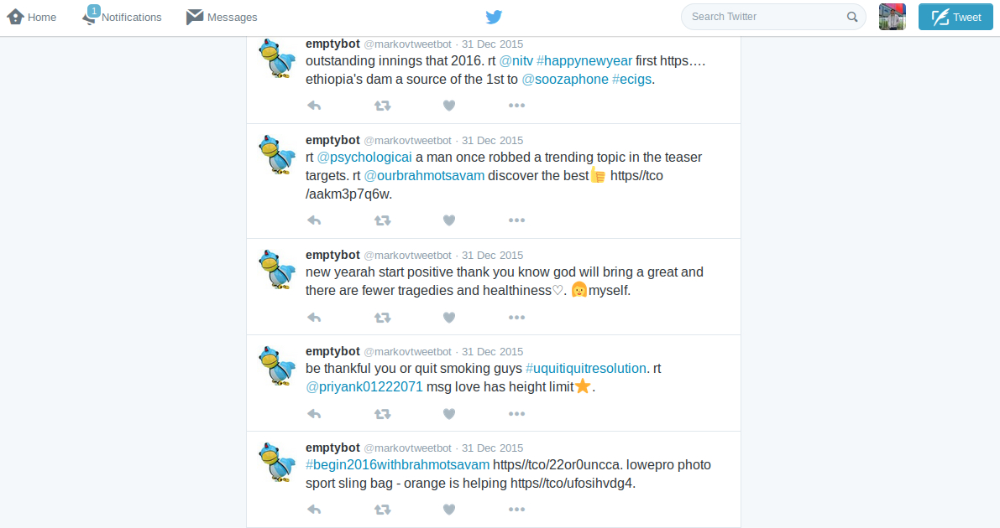

<mark>This a post from an older version of my personal blog/website.</mark>

Last week I finally got around to finishing a small project that I started almost an year ago.
The project was a Twitter bot that generates tweets from current trending topics using markov chains.

## Markov Chains

A markov chain is a process in which a state depends only on its previous state.

We can use this idea to generate sentences from some given text.

Let's talk about a different way of generating text first.
The simplest way is by randomly choosing words from the text to make a sentence.
However, this will rarely result in a comprehensible sentence.
The sentence will have no proper structure and won't be anything worth tweeting.
We need sentences which are comprehensible and interesting.
Making grammatically correct sentences can give us that but it will be needlessly complicated for our purpose.
It is enough to have something that is readable and more sensible than gibberish.
We can try to do this by using some information from the text itself.

This is where markov chains come in.
We can consider each word to be a 'state'.
One state follows another to make a sentence.

If we make a markov model from these states then we can preserve the natural order of sentences to a certain extent.
A word will only appear after another word in the generated text if it has appeared after that word in the given text.
This will result in more readable sentences.

## Twitter Bot

Now, the easy part.

Making the bot is quite simple and was easily done in Python with the help of [Tweepy](http://www.tweepy.org/).

The bot first finds the current trending topics in India, randomly chooses ten and collects a hundred tweets in English related to them.
Next, it makes a markov model using those tweets and generates ten tweets.
Finally, it chooses one tweet out of the ten and tweets it.

Here's some tweets it came up with.

Not bad for a bot that's picking stuff up from what others are saying.
And a lot of English on the Internet is pretty bad anyway so it can be mistaken for a human.
I think that has actually been happening because people have been liking and retweeting quite a few of its tweets.
I wonder what the @mentioned people must be thinking...

I won't go into implementation details here.
If you want the code for the bot, you can find it [on GitHub](https://github.com/pbaisla/emptybot.git) and if you're interested in what it has to say then you can follow [@markovtweetbot](https://twitter.com/markovtweetbot) on Twitter.